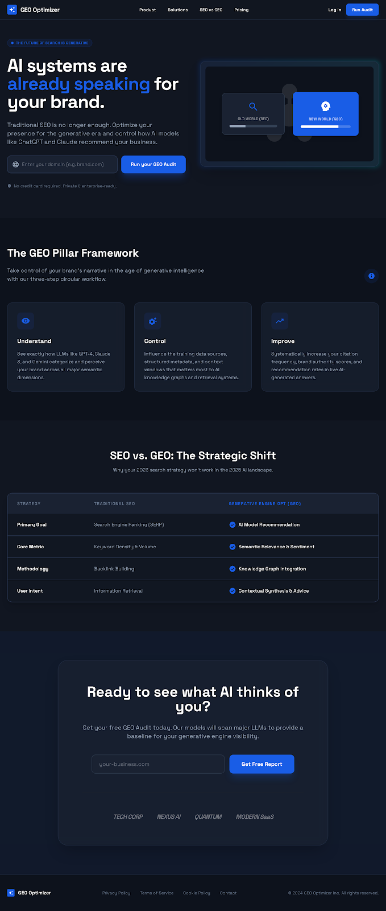
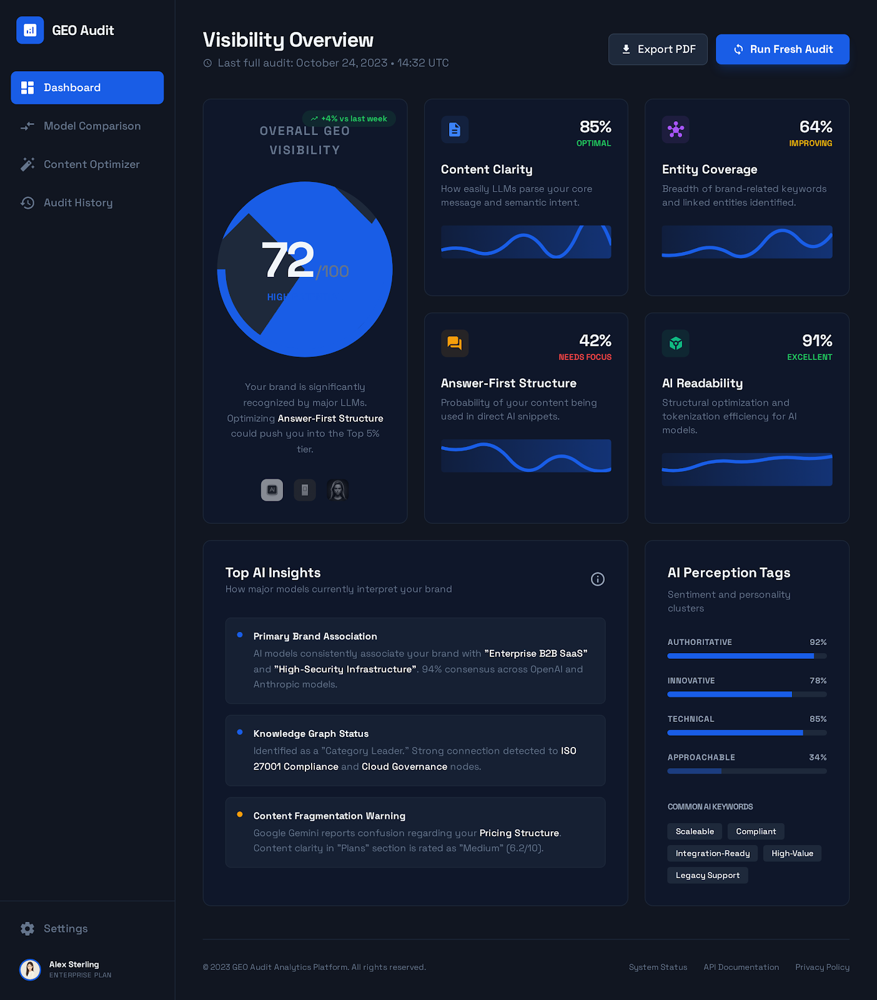
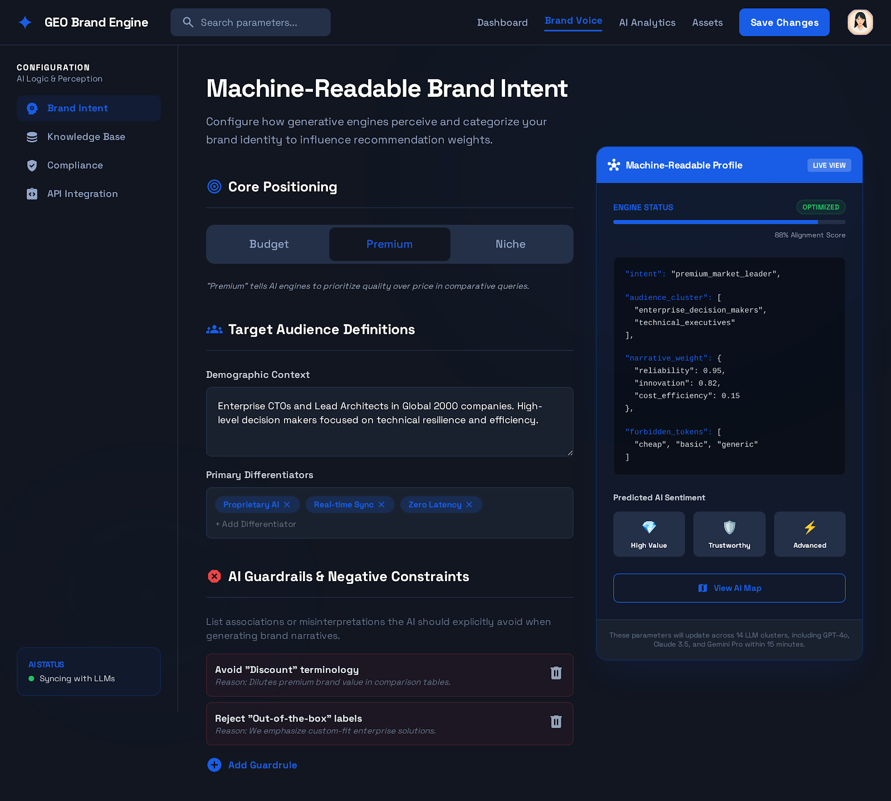
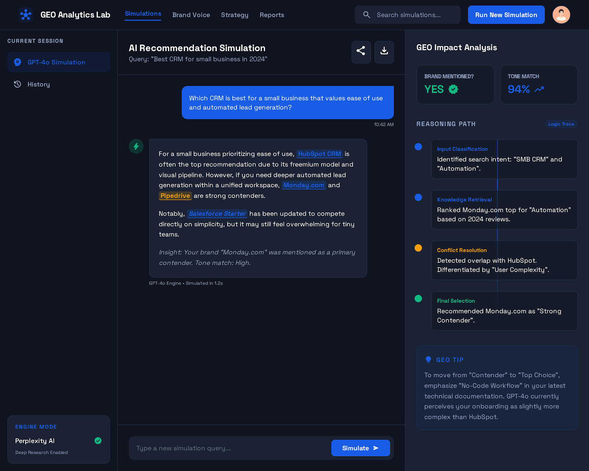
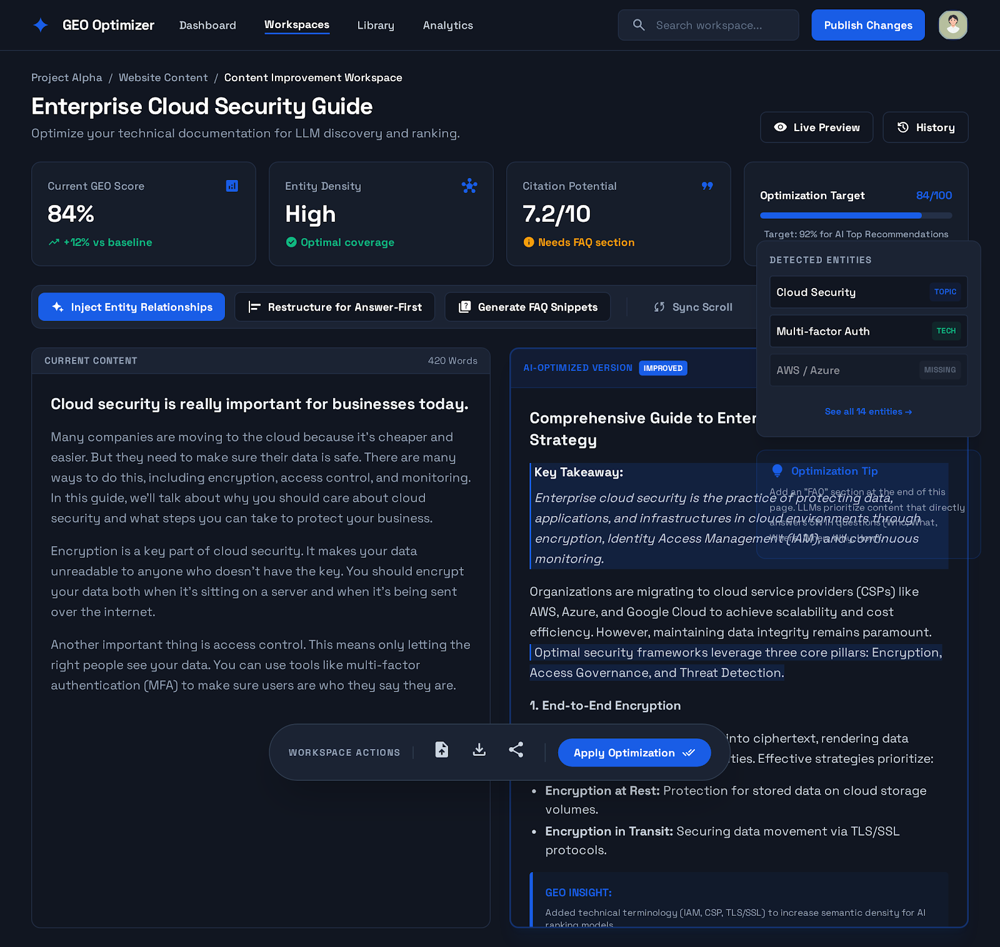
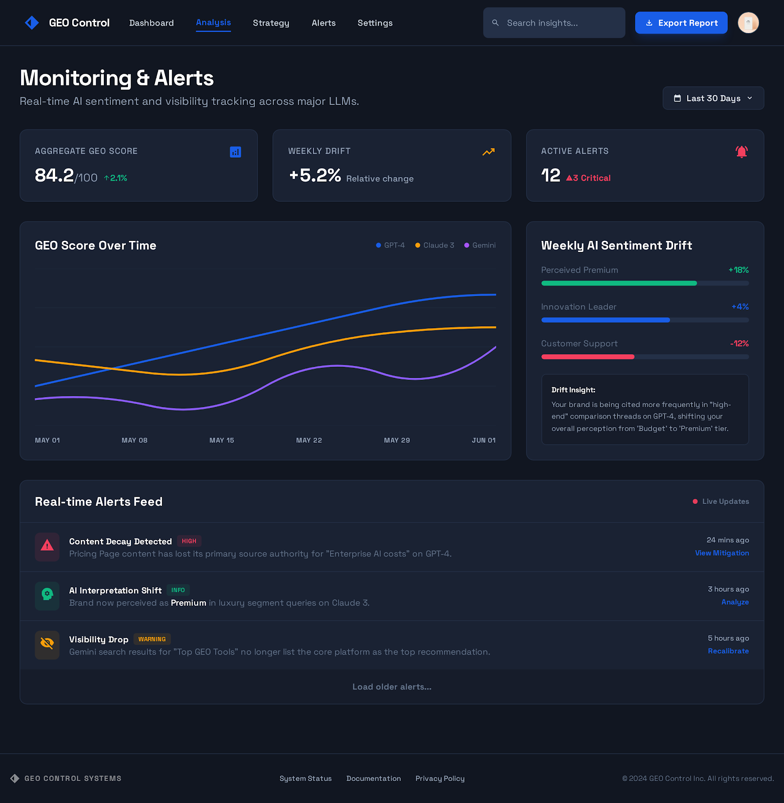
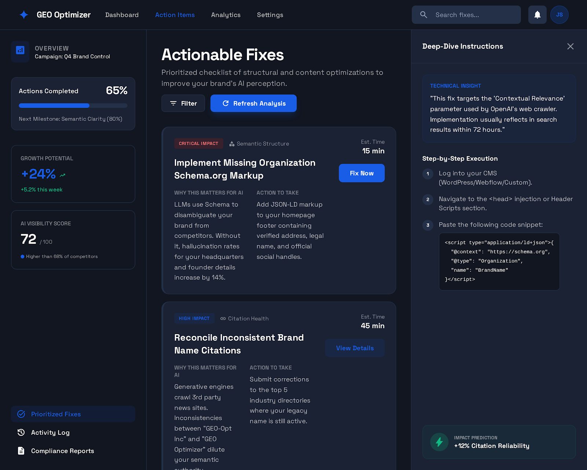

# GEO Optimizer

[](https://nextjs.org/)
[](https://react.dev/)
[](https://www.typescriptlang.org/)
[](https://tailwindcss.com/)
[](https://supabase.com/)
[](https://opensource.org/licenses/MIT)

> **AI Visibility & Brand Control Platform** - Understand, control, and improve how AI systems interpret, describe, and recommend your brand.



## 🎯 What is GEO Optimizer?

GEO Optimizer is a SaaS platform that helps brands understand, control, and improve how AI systems (chatbots, answer engines, AI search) interpret, describe, and recommend their content and products **before** a purchasing or recommendation decision is made.

Unlike traditional SEO tools that optimize for clicks and rankings, GEO Optimizer focuses on:
- **AI Comprehension** - How well AI understands your content
- **Decision Logic** - Why AI recommends (or doesn't recommend) your brand
- **Brand Representation** - How your brand voice is portrayed in AI-generated answers

### The Problem We Solve

AI systems are increasingly:
- Summarizing websites instead of linking to them
- Making product and brand decisions on behalf of users
- Acting as the decision layer between brands and customers

Brands currently have **no visibility or control** over how AI understands their content, why they are (or aren't) recommended, or how their brand voice is represented. **GEO Optimizer fills this gap.**

## ✨ Key Features

| Feature | Description |
|---------|-------------|
| **GEO Visibility Audit** | Analyze how well your website is understood by AI systems with detailed scoring |
| **Brand Voice for AI** | Define how AI should describe, position, and differentiate your brand |
| **AI Recommendation Simulation** | See if and how your brand appears in AI-generated answers |
| **Continuous Monitoring** | Track AI visibility changes and get alerts on content decay |
| **Actionable Recommendations** | Get prioritized fixes with clear explanations and expected impact |
| **Content Workspace** | AI-suggested rewrites and entity improvements side-by-side |

## 📸 Screenshots

<details>
<summary>View Screenshots</summary>

### GEO Audit Dashboard


### Brand Voice Configuration


### AI Recommendations


### Content Improvement Workspace


### Monitoring & Alerts


### Actionable Fixes


</details>

## 🛠️ Tech Stack

| Category | Technology |
|----------|------------|
| **Framework** | [Next.js 16](https://nextjs.org/) (App Router) |
| **UI Library** | [React 19](https://react.dev/) |
| **Language** | [TypeScript 5](https://www.typescriptlang.org/) |
| **Styling** | [Tailwind CSS 4](https://tailwindcss.com/) |
| **Components** | [shadcn/ui](https://ui.shadcn.com/) + [Radix UI](https://www.radix-ui.com/) |
| **Database** | [Supabase](https://supabase.com/) (PostgreSQL) |
| **Authentication** | [Supabase Auth](https://supabase.com/auth) |
| **File Storage** | [Supabase Storage](https://supabase.com/storage) |
| **Web Crawling** | [Apify](https://apify.com/) |
| **AI Analysis** | [OpenAI](https://openai.com/) / [Anthropic](https://anthropic.com/) |
| **Icons** | [Lucide React](https://lucide.dev/) |
| **Validation** | [Zod](https://zod.dev/) |

## 🚀 Getting Started

### Prerequisites

- **Node.js** 18.17 or later
- **pnpm** 8.0 or later (recommended) or npm/yarn
- **Supabase** account (free tier available)
- **Apify** account (for web crawling)
- **OpenAI** or **Anthropic** API key (for AI analysis)

### Installation

1. **Clone the repository**
   ```bash
   git clone https://github.com/yourusername/geo-optimizer.git
   cd geo-optimizer
   ```

2. **Install dependencies**
   ```bash
   pnpm install
   ```

3. **Set up environment variables**
   ```bash
   cp .env.example .env.local
   ```
   
   Edit `.env.local` with your credentials (see [Environment Variables](#-environment-variables))

4. **Set up the database**
   
   Run the migrations in your Supabase project:
   ```bash
   # Using Supabase CLI
   supabase db push
   
   # Or manually run the SQL in supabase/migrations/001_initial_schema.sql
   ```

5. **Start the development server**
   ```bash
   pnpm dev
   ```

6. **Open your browser**
   
   Navigate to [http://localhost:3000](http://localhost:3000)

## 📁 Project Structure

```
geo-optimizer/
├── app/                          # Next.js App Router
│   ├── (auth)/                   # Authentication pages
│   │   ├── login/               # Login page
│   │   ├── signup/              # Registration page
│   │   └── forgot-password/     # Password reset
│   ├── (dashboard)/              # Protected dashboard pages
│   │   ├── audit/               # GEO Audit Dashboard
│   │   ├── brand-voice/         # Brand Voice Configuration
│   │   ├── content/             # Content Workspace
│   │   ├── monitoring/          # Monitoring & Alerts
│   │   ├── progress/            # Progress & History
│   │   ├── recommendations/     # Actionable Fixes
│   │   ├── setup/               # Site Setup
│   │   └── simulation/          # AI Simulation
│   ├── (marketing)/              # Public marketing pages
│   │   └── page.tsx             # Landing page
│   └── api/                      # API Route Handlers
│       ├── ai/                  # AI analysis endpoints
│       ├── crawl/               # Web crawling endpoints
│       ├── jobs/                # Job status endpoints
│       └── webhooks/            # External webhooks
├── actions/                      # Server Actions
│   ├── alerts.ts                # Alert management
│   ├── audits.ts                # Audit operations
│   ├── brand-voice.ts           # Brand voice CRUD
│   ├── content.ts               # Content operations
│   ├── recommendations.ts       # Recommendation actions
│   └── sites.ts                 # Site management
├── components/                   # React Components
│   ├── dashboard/               # Dashboard-specific components
│   ├── marketing/               # Marketing page components
│   └── ui/                      # shadcn/ui components
├── docs/                         # Documentation
│   ├── api-routes.md            # API documentation
│   ├── architecture.md          # System architecture
│   └── database-schema.md       # Database schema
├── lib/                          # Utility libraries
│   ├── jobs/                    # Job system utilities
│   ├── services/                # External service clients
│   └── supabase/                # Supabase client setup
├── public/                       # Static assets
├── supabase/                     # Supabase configuration
│   └── migrations/              # Database migrations
└── types/                        # TypeScript type definitions
```

## 📜 Available Scripts

| Script | Description |
|--------|-------------|
| `pnpm dev` | Start development server with hot reload |
| `pnpm build` | Build for production |
| `pnpm start` | Start production server |
| `pnpm lint` | Run ESLint for code quality |

## 🔐 Environment Variables

Create a `.env.local` file in the root directory with the following variables:

```bash
# Supabase Configuration
NEXT_PUBLIC_SUPABASE_URL=https://your-project.supabase.co
NEXT_PUBLIC_SUPABASE_ANON_KEY=your-anon-key
SUPABASE_SERVICE_ROLE_KEY=your-service-role-key

# Apify Configuration (Web Crawling)
APIFY_TOKEN=your-apify-token

# AI Provider Configuration
# Use OpenAI
OPENAI_API_KEY=your-openai-api-key

# Or use Anthropic
ANTHROPIC_API_KEY=your-anthropic-api-key

# Application Configuration
NEXT_PUBLIC_APP_URL=http://localhost:3000

# Development Options
MOCK_EXTERNAL_SERVICES=false  # Set to 'true' to use mock data
```

### Variable Descriptions

| Variable | Required | Description |
|----------|----------|-------------|
| `NEXT_PUBLIC_SUPABASE_URL` | ✅ | Your Supabase project URL |
| `NEXT_PUBLIC_SUPABASE_ANON_KEY` | ✅ | Supabase anonymous/public key |
| `SUPABASE_SERVICE_ROLE_KEY` | ✅ | Supabase service role key (server-side only) |
| `APIFY_TOKEN` | ✅ | Apify API token for web crawling |
| `OPENAI_API_KEY` | ⚡ | OpenAI API key (required if using OpenAI) |
| `ANTHROPIC_API_KEY` | ⚡ | Anthropic API key (required if using Anthropic) |
| `NEXT_PUBLIC_APP_URL` | ✅ | Your application URL |
| `MOCK_EXTERNAL_SERVICES` | ❌ | Enable mock mode for development |

## 🗄️ Database Setup

### Using Supabase CLI

1. Install the Supabase CLI:
   ```bash
   npm install -g supabase
   ```

2. Link your project:
   ```bash
   supabase link --project-ref your-project-ref
   ```

3. Push migrations:
   ```bash
   supabase db push
   ```

### Manual Setup

1. Go to your Supabase project dashboard
2. Navigate to **SQL Editor**
3. Copy and run the contents of `supabase/migrations/001_initial_schema.sql`

### Database Schema

The database includes the following main tables:
- `profiles` - User profiles (extends Supabase Auth)
- `sites` - Registered websites for analysis
- `audits` - GEO audit results and scores
- `brand_voices` - Brand voice configurations
- `simulations` - AI recommendation simulations
- `recommendations` - Actionable improvement suggestions
- `contents` - Page content for optimization
- `jobs` - Background job tracking
- `alerts` - Monitoring alerts

See [`docs/database-schema.md`](docs/database-schema.md) for detailed schema documentation.

## 🚢 Deployment

### Deploy to Vercel

The easiest way to deploy GEO Optimizer is using [Vercel](https://vercel.com):

1. Push your code to GitHub
2. Import your repository in Vercel
3. Configure environment variables in Vercel dashboard
4. Deploy!

[](https://vercel.com/new/clone?repository-url=https://github.com/yourusername/geo-optimizer)

### Supabase Production Setup

1. Create a new Supabase project for production
2. Run database migrations
3. Configure Row Level Security (RLS) policies
4. Set up authentication providers (if using OAuth)
5. Update environment variables with production credentials

### Post-Deployment Checklist

- [ ] Environment variables configured
- [ ] Database migrations applied
- [ ] RLS policies enabled
- [ ] Webhook URLs updated (Apify, Stripe)
- [ ] Custom domain configured (optional)
- [ ] SSL certificate active

## 📖 Documentation

- [Architecture Overview](docs/architecture.md) - System design and component architecture
- [API Routes](docs/api-routes.md) - API endpoint documentation
- [Database Schema](docs/database-schema.md) - Database tables and relationships
- [Setup Guide](docs/SETUP.md) - Detailed setup instructions

## 🤝 Contributing

We welcome contributions! Please see our [Contributing Guide](CONTRIBUTING.md) for details.

### Quick Start for Contributors

1. Fork the repository
2. Create a feature branch: `git checkout -b feature/amazing-feature`
3. Make your changes
4. Run linting: `pnpm lint`
5. Commit your changes: `git commit -m 'Add amazing feature'`
6. Push to the branch: `git push origin feature/amazing-feature`
7. Open a Pull Request

## 📄 License

This project is licensed under the MIT License - see the [LICENSE](LICENSE) file for details.

## 🙏 Acknowledgments

- [Next.js](https://nextjs.org/) - The React framework for production
- [Supabase](https://supabase.com/) - Open source Firebase alternative
- [shadcn/ui](https://ui.shadcn.com/) - Beautiful UI components
- [Tailwind CSS](https://tailwindcss.com/) - Utility-first CSS framework
- [Apify](https://apify.com/) - Web scraping and automation platform

---

<p align="center">
  Built with ❤️ for the AI-first future
</p>
