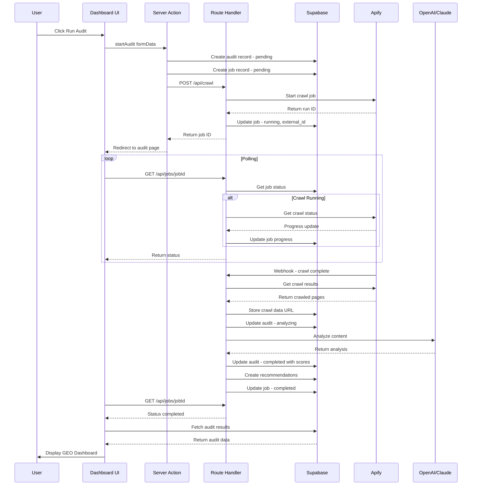
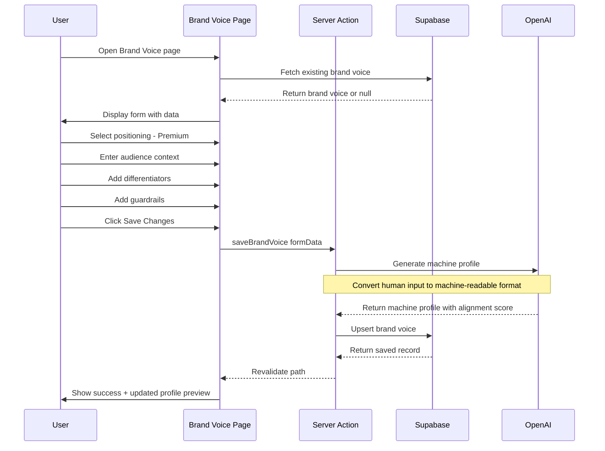
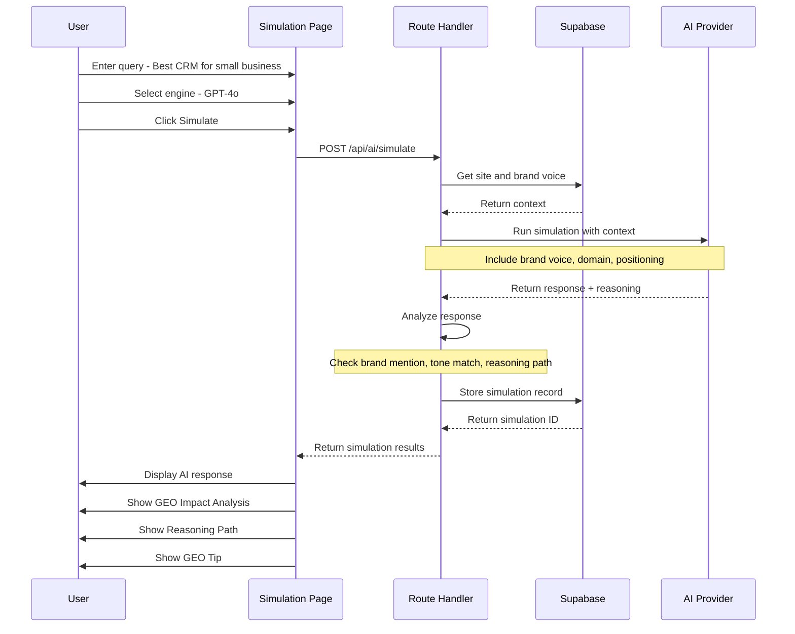
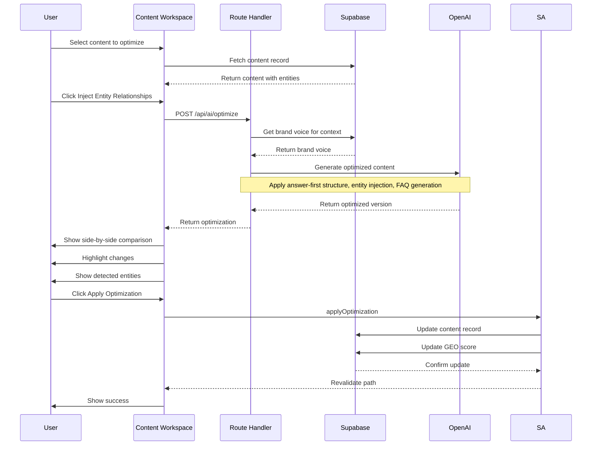
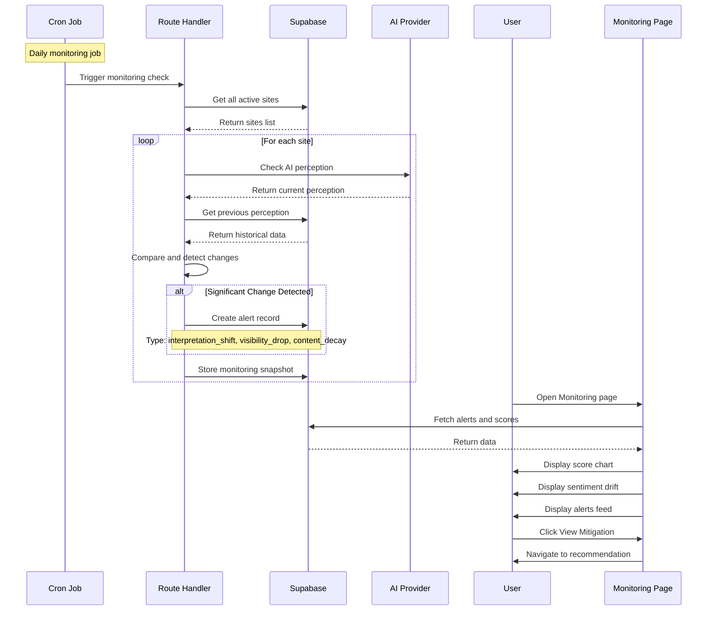

# GEO Optimizer - Architecture Document

## Table of Contents

1. [System Overview](#1-system-overview)
2. [Application Structure](#2-application-structure)
3. [Database Schema](#3-database-schema)
4. [API Design](#4-api-design)
5. [Job System Architecture](#5-job-system-architecture)
6. [Authentication & Authorization](#6-authentication--authorization)
7. [UI Component Architecture](#7-ui-component-architecture)
8. [Data Flow](#8-data-flow)

---

## 1. System Overview

### 1.1 High-Level Architecture

```
┌─────────────────────────────────────────────────────────────────────────────┐
│                              CLIENT LAYER                                    │
│  ┌─────────────────────────────────────────────────────────────────────┐   │
│  │                    Next.js App Router - React 19                     │   │
│  │  ┌──────────────┐  ┌──────────────┐  ┌──────────────────────────┐  │   │
│  │  │   Landing    │  │  Dashboard   │  │   Authenticated Pages    │  │   │
│  │  │    Page      │  │    Pages     │  │   - Brand Voice          │  │   │
│  │  │   - public   │  │   - audit    │  │   - Simulations          │  │   │
│  │  │              │  │   - monitor  │  │   - Workspace            │  │   │
│  │  └──────────────┘  └──────────────┘  └──────────────────────────┘  │   │
│  └─────────────────────────────────────────────────────────────────────┘   │
└─────────────────────────────────────────────────────────────────────────────┘
                                      │
                                      ▼
┌─────────────────────────────────────────────────────────────────────────────┐
│                              SERVER LAYER                                    │
│  ┌─────────────────────────────────────────────────────────────────────┐   │
│  │                         Next.js Server                               │   │
│  │  ┌──────────────────┐  ┌──────────────────┐  ┌──────────────────┐  │   │
│  │  │  Server Actions  │  │  Route Handlers  │  │   Middleware     │  │   │
│  │  │  - form submits  │  │  - /api/crawl    │  │   - auth check   │  │   │
│  │  │  - data mutations│  │  - /api/ai/*     │  │   - redirects    │  │   │
│  │  │                  │  │  - /api/jobs/*   │  │                  │  │   │
│  │  └──────────────────┘  └──────────────────┘  └──────────────────┘  │   │
│  └─────────────────────────────────────────────────────────────────────┘   │
└─────────────────────────────────────────────────────────────────────────────┘
                                      │
                                      ▼
┌─────────────────────────────────────────────────────────────────────────────┐
│                           EXTERNAL SERVICES                                  │
│  ┌──────────────┐  ┌──────────────┐  ┌──────────────┐  ┌──────────────┐   │
│  │   Supabase   │  │    Apify     │  │   OpenAI     │  │  Anthropic   │   │
│  │  - Auth      │  │  - Crawling  │  │  - GPT-4o    │  │  - Claude    │   │
│  │  - Database  │  │  - Scraping  │  │  - Analysis  │  │  - Analysis  │   │
│  │  - Storage   │  │              │  │              │  │              │   │
│  └──────────────┘  └──────────────┘  └──────────────┘  └──────────────┘   │
└─────────────────────────────────────────────────────────────────────────────┘
```

### 1.2 Technology Stack

| Layer | Technology | Purpose |
|-------|------------|---------|
| **Frontend** | Next.js 16 App Router | Server-first React framework |
| **UI Library** | React 19 | Component rendering |
| **Styling** | Tailwind CSS 4 | Utility-first CSS |
| **Components** | shadcn/ui | Pre-built accessible components |
| **Database** | Supabase PostgreSQL | Primary data store |
| **Auth** | Supabase Auth | Authentication & session management |
| **File Storage** | Supabase Storage | Crawl results, exports |
| **Web Crawling** | Apify | Website content extraction |
| **AI Analysis** | OpenAI GPT-4o, Anthropic Claude | GEO scoring & recommendations |
| **State** | React Server Components + URL state | Minimal client state |

### 1.3 Core Design Principles

1. **Server-First Architecture**: Default to Server Components; use Client Components only for interactivity
2. **Progressive Enhancement**: Core functionality works without JavaScript
3. **Job-Based Processing**: Long-running tasks tracked via database polling
4. **Type Safety**: Full TypeScript coverage with strict mode
5. **Security by Default**: Row Level Security on all tables
6. **AI-Agnostic**: Abstract AI providers for easy switching/comparison

---

## 2. Application Structure

### 2.1 Next.js App Router Folder Structure

```
app/
├── (marketing)/                    # Public marketing pages - no auth required
│   ├── layout.tsx                  # Marketing layout with public nav
│   ├── page.tsx                    # Landing page - Hero, GEO vs SEO, CTA
│   ├── pricing/
│   │   └── page.tsx               # Pricing plans
│   └── seo-vs-geo/
│       └── page.tsx               # Educational content
│
├── (auth)/                         # Authentication pages
│   ├── layout.tsx                  # Minimal auth layout
│   ├── login/
│   │   └── page.tsx               # Login form
│   ├── signup/
│   │   └── page.tsx               # Registration form
│   └── callback/
│       └── route.ts               # OAuth callback handler
│
├── (dashboard)/                    # Authenticated app pages
│   ├── layout.tsx                  # Dashboard layout with sidebar
│   ├── setup/
│   │   └── page.tsx               # Site Setup - domain input, crawl config
│   ├── audit/
│   │   ├── page.tsx               # GEO Audit Dashboard
│   │   ├── [auditId]/
│   │   │   └── page.tsx           # Specific audit details
│   │   └── history/
│   │       └── page.tsx           # Audit history
│   ├── brand-voice/
│   │   ├── page.tsx               # Brand Voice configuration
│   │   └── preview/
│   │       └── page.tsx           # Machine-readable profile preview
│   ├── simulations/
│   │   ├── page.tsx               # AI Recommendation Simulation
│   │   ├── new/
│   │   │   └── page.tsx           # Create new simulation
│   │   └── [simulationId]/
│   │       └── page.tsx           # Simulation results
│   ├── recommendations/
│   │   ├── page.tsx               # Actionable Fixes list
│   │   └── [recommendationId]/
│   │       └── page.tsx           # Recommendation details
│   ├── workspace/
│   │   ├── page.tsx               # Content library
│   │   └── [contentId]/
│   │       └── page.tsx           # Content Improvement Workspace
│   ├── monitoring/
│   │   ├── page.tsx               # Monitoring & Alerts dashboard
│   │   └── alerts/
│   │       └── page.tsx           # Alert management
│   ├── progress/
│   │   └── page.tsx               # Progress & History
│   ├── assistant/
│   │   └── page.tsx               # GEO Assistant chat
│   └── settings/
│       ├── page.tsx               # Account settings
│       ├── team/
│       │   └── page.tsx           # Team management
│       └── billing/
│           └── page.tsx           # Subscription management
│
├── api/                            # Route Handlers for external services
│   ├── crawl/
│   │   ├── route.ts               # Start crawl job
│   │   └── [jobId]/
│   │       └── route.ts           # Get crawl status
│   ├── ai/
│   │   ├── analyze/
│   │   │   └── route.ts           # GEO analysis
│   │   ├── simulate/
│   │   │   └── route.ts           # AI recommendation simulation
│   │   ├── optimize/
│   │   │   └── route.ts           # Content optimization
│   │   └── assistant/
│   │       └── route.ts           # GEO Assistant streaming
│   ├── jobs/
│   │   └── [jobId]/
│   │       └── route.ts           # Job status polling
│   └── webhooks/
│       ├── apify/
│       │   └── route.ts           # Apify completion webhook
│       └── stripe/
│           └── route.ts           # Stripe payment webhook
│
├── layout.tsx                      # Root layout
├── globals.css                     # Global styles
├── error.tsx                       # Global error boundary
├── not-found.tsx                   # 404 page
└── loading.tsx                     # Global loading state
```

### 2.2 Supporting Directories

```
components/
├── ui/                             # shadcn/ui components
│   ├── button.tsx
│   ├── card.tsx
│   ├── input.tsx
│   └── ...
├── layout/                         # Layout components
│   ├── marketing-nav.tsx
│   ├── dashboard-sidebar.tsx
│   ├── dashboard-header.tsx
│   └── footer.tsx
├── audit/                          # Audit-specific components
│   ├── visibility-score.tsx
│   ├── sub-score-card.tsx
│   ├── ai-insights.tsx
│   └── perception-tags.tsx
├── brand-voice/                    # Brand Voice components
│   ├── positioning-selector.tsx
│   ├── audience-form.tsx
│   ├── differentiator-tags.tsx
│   └── guardrails-list.tsx
├── simulation/                     # Simulation components
│   ├── query-input.tsx
│   ├── ai-response.tsx
│   ├── reasoning-path.tsx
│   └── impact-analysis.tsx
├── workspace/                      # Content workspace components
│   ├── content-editor.tsx
│   ├── optimized-preview.tsx
│   ├── entity-panel.tsx
│   └── diff-viewer.tsx
├── monitoring/                     # Monitoring components
│   ├── score-chart.tsx
│   ├── sentiment-drift.tsx
│   └── alert-feed.tsx
└── shared/                         # Shared components
    ├── job-status.tsx
    ├── score-badge.tsx
    └── loading-skeleton.tsx

lib/
├── supabase/
│   ├── client.ts                   # Browser client
│   ├── server.ts                   # Server client
│   ├── middleware.ts               # Auth middleware helper
│   └── types.ts                    # Generated database types
├── ai/
│   ├── providers/
│   │   ├── openai.ts
│   │   ├── anthropic.ts
│   │   └── index.ts                # Provider factory
│   ├── prompts/
│   │   ├── geo-analysis.ts
│   │   ├── simulation.ts
│   │   └── optimization.ts
│   └── types.ts
├── apify/
│   ├── client.ts
│   └── types.ts
├── utils/
│   ├── cn.ts                       # Class name utility
│   ├── format.ts                   # Formatting helpers
│   └── validation.ts               # Zod schemas
└── constants/
    ├── scores.ts                   # Score thresholds
    └── routes.ts                   # Route constants

actions/                            # Server Actions
├── auth.ts                         # Auth actions
├── sites.ts                        # Site management
├── audits.ts                       # Audit operations
├── brand-voice.ts                  # Brand voice CRUD
├── simulations.ts                  # Simulation actions
├── recommendations.ts              # Recommendation actions
├── content.ts                      # Content operations
└── alerts.ts                       # Alert management

types/
├── database.ts                     # Supabase generated types
├── api.ts                          # API request/response types
└── domain.ts                       # Domain model types
```

### 2.3 Page Routing and Layouts

#### Route Groups Strategy

| Group | Purpose | Layout Features |
|-------|---------|-----------------|
| `(marketing)` | Public pages | Marketing nav, footer, no auth |
| `(auth)` | Login/signup | Minimal layout, centered content |
| `(dashboard)` | App pages | Sidebar, header, auth required |

#### Layout Hierarchy

```tsx
// app/layout.tsx - Root layout
export default function RootLayout({ children }: { children: React.ReactNode }) {
  return (
    <html lang="en" className={inter.variable}>
      <body className="min-h-screen bg-background antialiased">
        {children}
      </body>
    </html>
  );
}

// app/(dashboard)/layout.tsx - Dashboard layout
export default async function DashboardLayout({ children }: { children: React.ReactNode }) {
  const supabase = await createServerClient();
  const { data: { user } } = await supabase.auth.getUser();
  
  if (!user) redirect('/login');
  
  return (
    <div className="flex h-screen">
      <DashboardSidebar user={user} />
      <main className="flex-1 overflow-auto">
        <DashboardHeader />
        {children}
      </main>
    </div>
  );
}
```

### 2.4 Server vs Client Component Strategy

#### Server Components - Default

Use for:
- Data fetching
- Database queries
- Accessing backend resources
- Rendering static content
- SEO-critical content

```tsx
// app/(dashboard)/audit/page.tsx - Server Component
export default async function AuditPage() {
  const supabase = await createServerClient();
  const { data: audits } = await supabase
    .from('audits')
    .select('*')
    .order('created_at', { ascending: false });
  
  return <AuditDashboard audits={audits} />;
}
```

#### Client Components - When Necessary

Use for:
- Event handlers - onClick, onChange
- Browser APIs - localStorage, geolocation
- State management - useState, useReducer
- Effects - useEffect, useLayoutEffect
- Real-time updates - polling, subscriptions

```tsx
// components/audit/visibility-score.tsx
'use client';

import { useState, useEffect } from 'react';

export function VisibilityScore({ auditId }: { auditId: string }) {
  const [score, setScore] = useState<number | null>(null);
  
  useEffect(() => {
    // Poll for score updates during analysis
    const interval = setInterval(async () => {
      const res = await fetch(`/api/jobs/${auditId}`);
      const data = await res.json();
      if (data.status === 'completed') {
        setScore(data.result.score);
        clearInterval(interval);
      }
    }, 2000);
    
    return () => clearInterval(interval);
  }, [auditId]);
  
  return <ScoreDisplay score={score} />;
}
```

---

## 3. Database Schema

### 3.1 Entity Relationship Diagram

```
┌──────────────────┐       ┌──────────────────┐       ┌──────────────────┐
│      users       │       │      sites       │       │     audits       │
├──────────────────┤       ├──────────────────┤       ├──────────────────┤
│ id (PK)          │──┐    │ id (PK)          │──┐    │ id (PK)          │
│ email            │  │    │ user_id (FK)     │  │    │ site_id (FK)     │
│ full_name        │  └───>│ domain           │  └───>│ status           │
│ avatar_url       │       │ name             │       │ overall_score    │
│ created_at       │       │ crawl_config     │       │ sub_scores       │
│ updated_at       │       │ created_at       │       │ insights         │
└──────────────────┘       │ updated_at       │       │ created_at       │
                           └──────────────────┘       │ completed_at     │
                                    │                 └──────────────────┘
                                    │
                                    ▼
┌──────────────────┐       ┌──────────────────┐       ┌──────────────────┐
│   brand_voices   │       │   simulations    │       │ recommendations  │
├──────────────────┤       ├──────────────────┤       ├──────────────────┤
│ id (PK)          │       │ id (PK)          │       │ id (PK)          │
│ site_id (FK)     │<──────│ site_id (FK)     │       │ audit_id (FK)    │
│ positioning      │       │ query            │       │ type             │
│ audience         │       │ ai_response      │       │ priority         │
│ differentiators  │       │ brand_mentioned  │       │ title            │
│ guardrails       │       │ tone_match       │       │ description      │
│ created_at       │       │ reasoning_path   │       │ action           │
│ updated_at       │       │ engine           │       │ impact           │
└──────────────────┘       │ created_at       │       │ status           │
                           └──────────────────┘       │ created_at       │
                                                      └──────────────────┘
        │
        ▼
┌──────────────────┐       ┌──────────────────┐       ┌──────────────────┐
│    contents      │       │      jobs        │       │     alerts       │
├──────────────────┤       ├──────────────────┤       ├──────────────────┤
│ id (PK)          │       │ id (PK)          │       │ id (PK)          │
│ site_id (FK)     │       │ user_id (FK)     │       │ site_id (FK)     │
│ url              │       │ type             │       │ type             │
│ title            │       │ status           │       │ severity         │
│ original_content │       │ payload          │       │ title            │
│ optimized_content│       │ result           │       │ message          │
│ geo_score        │       │ error            │       │ data             │
│ entity_density   │       │ progress         │       │ read             │
│ created_at       │       │ created_at       │       │ created_at       │
│ updated_at       │       │ started_at       │       └──────────────────┘
└──────────────────┘       │ completed_at     │
                           └──────────────────┘
```

### 3.2 Table Definitions

#### Users Table - Extended from Supabase Auth

```sql
-- Users are managed by Supabase Auth
-- This table extends auth.users with app-specific data
CREATE TABLE public.profiles (
  id UUID PRIMARY KEY REFERENCES auth.users(id) ON DELETE CASCADE,
  email TEXT NOT NULL,
  full_name TEXT,
  avatar_url TEXT,
  plan TEXT DEFAULT 'free' CHECK (plan IN ('free', 'pro', 'enterprise')),
  created_at TIMESTAMPTZ DEFAULT NOW(),
  updated_at TIMESTAMPTZ DEFAULT NOW()
);

-- Trigger to create profile on signup
CREATE OR REPLACE FUNCTION public.handle_new_user()
RETURNS TRIGGER AS $$
BEGIN
  INSERT INTO public.profiles (id, email, full_name, avatar_url)
  VALUES (
    NEW.id,
    NEW.email,
    NEW.raw_user_meta_data->>'full_name',
    NEW.raw_user_meta_data->>'avatar_url'
  );
  RETURN NEW;
END;
$$ LANGUAGE plpgsql SECURITY DEFINER;

CREATE TRIGGER on_auth_user_created
  AFTER INSERT ON auth.users
  FOR EACH ROW EXECUTE FUNCTION public.handle_new_user();
```

#### Sites Table

```sql
CREATE TABLE public.sites (
  id UUID PRIMARY KEY DEFAULT gen_random_uuid(),
  user_id UUID NOT NULL REFERENCES public.profiles(id) ON DELETE CASCADE,
  domain TEXT NOT NULL,
  name TEXT,
  crawl_config JSONB DEFAULT '{
    "max_pages": 50,
    "include_patterns": [],
    "exclude_patterns": [],
    "respect_robots": true
  }'::jsonb,
  last_crawl_at TIMESTAMPTZ,
  created_at TIMESTAMPTZ DEFAULT NOW(),
  updated_at TIMESTAMPTZ DEFAULT NOW(),
  
  UNIQUE(user_id, domain)
);

CREATE INDEX idx_sites_user_id ON public.sites(user_id);
CREATE INDEX idx_sites_domain ON public.sites(domain);
```

#### Audits Table

```sql
CREATE TABLE public.audits (
  id UUID PRIMARY KEY DEFAULT gen_random_uuid(),
  site_id UUID NOT NULL REFERENCES public.sites(id) ON DELETE CASCADE,
  job_id UUID REFERENCES public.jobs(id),
  status TEXT DEFAULT 'pending' CHECK (status IN ('pending', 'crawling', 'analyzing', 'completed', 'failed')),
  
  -- Overall GEO Visibility Score
  overall_score INTEGER CHECK (overall_score >= 0 AND overall_score <= 100),
  score_change INTEGER, -- vs previous audit
  
  -- Sub-scores stored as JSONB for flexibility
  sub_scores JSONB DEFAULT '{}'::jsonb,
  -- Example: {
  --   "content_clarity": { "score": 85, "status": "optimal", "description": "..." },
  --   "entity_coverage": { "score": 64, "status": "improving", "description": "..." },
  --   "answer_first": { "score": 42, "status": "needs_focus", "description": "..." },
  --   "ai_readability": { "score": 91, "status": "excellent", "description": "..." }
  -- }
  
  -- AI Insights
  insights JSONB DEFAULT '[]'::jsonb,
  -- Example: [
  --   { "type": "brand_association", "title": "...", "description": "...", "severity": "info" },
  --   { "type": "knowledge_graph", "title": "...", "description": "...", "severity": "success" },
  --   { "type": "fragmentation", "title": "...", "description": "...", "severity": "warning" }
  -- ]
  
  -- AI Perception Tags
  perception_tags JSONB DEFAULT '{}'::jsonb,
  -- Example: {
  --   "authoritative": 92,
  --   "innovative": 78,
  --   "technical": 85,
  --   "approachable": 34
  -- }
  
  -- Common AI Keywords
  ai_keywords TEXT[] DEFAULT '{}',
  
  -- Raw crawl data reference
  crawl_data_url TEXT,
  
  created_at TIMESTAMPTZ DEFAULT NOW(),
  completed_at TIMESTAMPTZ,
  
  -- Ensure only one active audit per site
  CONSTRAINT one_active_audit_per_site UNIQUE (site_id, status) 
    WHERE status IN ('pending', 'crawling', 'analyzing')
);

CREATE INDEX idx_audits_site_id ON public.audits(site_id);
CREATE INDEX idx_audits_status ON public.audits(status);
CREATE INDEX idx_audits_created_at ON public.audits(created_at DESC);
```

#### Brand Voices Table

```sql
CREATE TABLE public.brand_voices (
  id UUID PRIMARY KEY DEFAULT gen_random_uuid(),
  site_id UUID NOT NULL REFERENCES public.sites(id) ON DELETE CASCADE,
  
  -- Core Positioning
  positioning TEXT CHECK (positioning IN ('budget', 'premium', 'niche', 'expert')),
  positioning_description TEXT,
  
  -- Target Audience
  audience JSONB DEFAULT '{}'::jsonb,
  -- Example: {
  --   "demographic_context": "Enterprise CTOs and Lead Architects...",
  --   "intent_signals": ["technical resilience", "efficiency"],
  --   "decision_factors": ["security", "scalability"]
  -- }
  
  -- Differentiators
  differentiators TEXT[] DEFAULT '{}',
  -- Example: ["Proprietary AI", "Real-time Sync", "Zero Latency"]
  
  -- AI Guardrails - Negative Constraints
  guardrails JSONB DEFAULT '[]'::jsonb,
  -- Example: [
  --   { "avoid": "Discount terminology", "reason": "Dilutes premium brand value" },
  --   { "avoid": "Out-of-the-box labels", "reason": "We emphasize custom solutions" }
  -- ]
  
  -- Machine-Readable Profile - Generated
  machine_profile JSONB DEFAULT '{}'::jsonb,
  -- Example: {
  --   "intent": "premium_market_leader",
  --   "audience_cluster": ["enterprise_decision_makers", "technical_executives"],
  --   "narrative_weight": { "reliability": 0.95, "innovation": 0.82 },
  --   "forbidden_tokens": ["cheap", "basic", "generic"]
  -- }
  
  -- Alignment Score
  alignment_score INTEGER CHECK (alignment_score >= 0 AND alignment_score <= 100),
  
  created_at TIMESTAMPTZ DEFAULT NOW(),
  updated_at TIMESTAMPTZ DEFAULT NOW(),
  
  -- One brand voice per site
  UNIQUE(site_id)
);

CREATE INDEX idx_brand_voices_site_id ON public.brand_voices(site_id);
```

#### Simulations Table

```sql
CREATE TABLE public.simulations (
  id UUID PRIMARY KEY DEFAULT gen_random_uuid(),
  site_id UUID NOT NULL REFERENCES public.sites(id) ON DELETE CASCADE,
  job_id UUID REFERENCES public.jobs(id),
  
  -- Query
  query TEXT NOT NULL,
  engine TEXT DEFAULT 'gpt-4o' CHECK (engine IN ('gpt-4o', 'claude-3', 'gemini', 'perplexity')),
  
  -- Results
  ai_response TEXT,
  brand_mentioned BOOLEAN,
  tone_match INTEGER CHECK (tone_match >= 0 AND tone_match <= 100),
  
  -- Reasoning Path
  reasoning_path JSONB DEFAULT '[]'::jsonb,
  -- Example: [
  --   { "step": "input_classification", "description": "Identified search intent..." },
  --   { "step": "knowledge_retrieval", "description": "Ranked Monday.com top..." },
  --   { "step": "conflict_resolution", "description": "Detected overlap with..." },
  --   { "step": "final_selection", "description": "Recommended as Strong Contender" }
  -- ]
  
  -- GEO Tip
  geo_tip TEXT,
  
  created_at TIMESTAMPTZ DEFAULT NOW()
);

CREATE INDEX idx_simulations_site_id ON public.simulations(site_id);
CREATE INDEX idx_simulations_created_at ON public.simulations(created_at DESC);
```

#### Recommendations Table

```sql
CREATE TABLE public.recommendations (
  id UUID PRIMARY KEY DEFAULT gen_random_uuid(),
  audit_id UUID NOT NULL REFERENCES public.audits(id) ON DELETE CASCADE,
  
  -- Classification
  type TEXT NOT NULL CHECK (type IN (
    'semantic_structure', 'citation_health', 'entity_definition',
    'answer_first', 'schema_markup', 'content_clarity', 'other'
  )),
  priority TEXT NOT NULL CHECK (priority IN ('critical', 'high', 'medium', 'low')),
  
  -- Content
  title TEXT NOT NULL,
  description TEXT,
  why_matters TEXT, -- Why this matters for AI
  action TEXT, -- What to do
  
  -- Impact
  estimated_impact TEXT, -- e.g., "+12% Citation Reliability"
  estimated_time TEXT, -- e.g., "15 min"
  
  -- Execution Details
  execution_steps JSONB DEFAULT '[]'::jsonb,
  code_snippet TEXT,
  
  -- Status
  status TEXT DEFAULT 'pending' CHECK (status IN ('pending', 'in_progress', 'completed', 'dismissed')),
  completed_at TIMESTAMPTZ,
  
  created_at TIMESTAMPTZ DEFAULT NOW()
);

CREATE INDEX idx_recommendations_audit_id ON public.recommendations(audit_id);
CREATE INDEX idx_recommendations_priority ON public.recommendations(priority);
CREATE INDEX idx_recommendations_status ON public.recommendations(status);
```

#### Contents Table

```sql
CREATE TABLE public.contents (
  id UUID PRIMARY KEY DEFAULT gen_random_uuid(),
  site_id UUID NOT NULL REFERENCES public.sites(id) ON DELETE CASCADE,
  
  -- Source
  url TEXT NOT NULL,
  title TEXT,
  
  -- Content
  original_content TEXT,
  optimized_content TEXT,
  
  -- Scores
  geo_score INTEGER CHECK (geo_score >= 0 AND geo_score <= 100),
  entity_density TEXT CHECK (entity_density IN ('low', 'medium', 'high')),
  citation_potential NUMERIC(3,1), -- e.g., 7.2/10
  
  -- Detected Entities
  entities JSONB DEFAULT '[]'::jsonb,
  -- Example: [
  --   { "name": "Cloud Security", "type": "topic", "status": "detected" },
  --   { "name": "Multi-factor Auth", "type": "tech", "status": "detected" },
  --   { "name": "AWS / Azure", "type": "tech", "status": "missing" }
  -- ]
  
  -- Optimization Metadata
  optimization_tips JSONB DEFAULT '[]'::jsonb,
  last_optimized_at TIMESTAMPTZ,
  
  created_at TIMESTAMPTZ DEFAULT NOW(),
  updated_at TIMESTAMPTZ DEFAULT NOW(),
  
  UNIQUE(site_id, url)
);

CREATE INDEX idx_contents_site_id ON public.contents(site_id);
CREATE INDEX idx_contents_geo_score ON public.contents(geo_score);
```

#### Jobs Table

```sql
CREATE TABLE public.jobs (
  id UUID PRIMARY KEY DEFAULT gen_random_uuid(),
  user_id UUID NOT NULL REFERENCES public.profiles(id) ON DELETE CASCADE,
  
  -- Job Type
  type TEXT NOT NULL CHECK (type IN (
    'crawl', 'analyze', 'simulate', 'optimize', 'export'
  )),
  
  -- Status
  status TEXT DEFAULT 'pending' CHECK (status IN (
    'pending', 'running', 'completed', 'failed', 'cancelled'
  )),
  
  -- Progress (0-100)
  progress INTEGER DEFAULT 0 CHECK (progress >= 0 AND progress <= 100),
  progress_message TEXT,
  
  -- Payload - Input data for the job
  payload JSONB NOT NULL DEFAULT '{}'::jsonb,
  
  -- Result - Output data from the job
  result JSONB,
  
  -- Error handling
  error TEXT,
  error_details JSONB,
  retry_count INTEGER DEFAULT 0,
  max_retries INTEGER DEFAULT 3,
  
  -- Timestamps
  created_at TIMESTAMPTZ DEFAULT NOW(),
  started_at TIMESTAMPTZ,
  completed_at TIMESTAMPTZ,
  
  -- External reference (e.g., Apify run ID)
  external_id TEXT,
  external_service TEXT
);

CREATE INDEX idx_jobs_user_id ON public.jobs(user_id);
CREATE INDEX idx_jobs_status ON public.jobs(status);
CREATE INDEX idx_jobs_type ON public.jobs(type);
CREATE INDEX idx_jobs_created_at ON public.jobs(created_at DESC);
```

#### Alerts Table

```sql
CREATE TABLE public.alerts (
  id UUID PRIMARY KEY DEFAULT gen_random_uuid(),
  site_id UUID NOT NULL REFERENCES public.sites(id) ON DELETE CASCADE,
  
  -- Alert Type
  type TEXT NOT NULL CHECK (type IN (
    'content_decay', 'interpretation_shift', 'visibility_drop',
    'score_change', 'competitor_mention', 'system'
  )),
  severity TEXT NOT NULL CHECK (severity IN ('info', 'warning', 'high', 'critical')),
  
  -- Content
  title TEXT NOT NULL,
  message TEXT NOT NULL,
  
  -- Additional Data
  data JSONB DEFAULT '{}'::jsonb,
  -- Example for content_decay: {
  --   "page_url": "/pricing",
  --   "previous_authority": "primary",
  --   "current_authority": "secondary",
  --   "affected_query": "Enterprise AI costs"
  -- }
  
  -- Action
  action_url TEXT,
  action_label TEXT,
  
  -- Status
  read BOOLEAN DEFAULT FALSE,
  dismissed BOOLEAN DEFAULT FALSE,
  
  created_at TIMESTAMPTZ DEFAULT NOW()
);

CREATE INDEX idx_alerts_site_id ON public.alerts(site_id);
CREATE INDEX idx_alerts_read ON public.alerts(read) WHERE read = FALSE;
CREATE INDEX idx_alerts_created_at ON public.alerts(created_at DESC);
```

### 3.3 Row Level Security Policies

```sql
-- Enable RLS on all tables
ALTER TABLE public.profiles ENABLE ROW LEVEL SECURITY;
ALTER TABLE public.sites ENABLE ROW LEVEL SECURITY;
ALTER TABLE public.audits ENABLE ROW LEVEL SECURITY;
ALTER TABLE public.brand_voices ENABLE ROW LEVEL SECURITY;
ALTER TABLE public.simulations ENABLE ROW LEVEL SECURITY;
ALTER TABLE public.recommendations ENABLE ROW LEVEL SECURITY;
ALTER TABLE public.contents ENABLE ROW LEVEL SECURITY;
ALTER TABLE public.jobs ENABLE ROW LEVEL SECURITY;
ALTER TABLE public.alerts ENABLE ROW LEVEL SECURITY;

-- Profiles: Users can only access their own profile
CREATE POLICY "Users can view own profile"
  ON public.profiles FOR SELECT
  USING (auth.uid() = id);

CREATE POLICY "Users can update own profile"
  ON public.profiles FOR UPDATE
  USING (auth.uid() = id);

-- Sites: Users can only access their own sites
CREATE POLICY "Users can view own sites"
  ON public.sites FOR SELECT
  USING (auth.uid() = user_id);

CREATE POLICY "Users can create sites"
  ON public.sites FOR INSERT
  WITH CHECK (auth.uid() = user_id);

CREATE POLICY "Users can update own sites"
  ON public.sites FOR UPDATE
  USING (auth.uid() = user_id);

CREATE POLICY "Users can delete own sites"
  ON public.sites FOR DELETE
  USING (auth.uid() = user_id);

-- Audits: Access through site ownership
CREATE POLICY "Users can view audits for own sites"
  ON public.audits FOR SELECT
  USING (
    EXISTS (
      SELECT 1 FROM public.sites
      WHERE sites.id = audits.site_id
      AND sites.user_id = auth.uid()
    )
  );

CREATE POLICY "Users can create audits for own sites"
  ON public.audits FOR INSERT
  WITH CHECK (
    EXISTS (
      SELECT 1 FROM public.sites
      WHERE sites.id = site_id
      AND sites.user_id = auth.uid()
    )
  );

-- Similar policies for other tables...
-- Brand Voices, Simulations, Recommendations, Contents, Alerts
-- All follow the pattern of checking site ownership

-- Jobs: Users can only access their own jobs
CREATE POLICY "Users can view own jobs"
  ON public.jobs FOR SELECT
  USING (auth.uid() = user_id);

CREATE POLICY "Users can create jobs"
  ON public.jobs FOR INSERT
  WITH CHECK (auth.uid() = user_id);
```

---

## 4. API Design

### 4.1 Route Handlers Structure

#### Crawl API

```typescript
// app/api/crawl/route.ts
import { createServerClient } from '@/lib/supabase/server';
import { startCrawlJob } from '@/lib/apify/client';
import { NextRequest, NextResponse } from 'next/server';

export async function POST(request: NextRequest) {
  const supabase = await createServerClient();
  const { data: { user } } = await supabase.auth.getUser();
  
  if (!user) {
    return NextResponse.json({ error: 'Unauthorized' }, { status: 401 });
  }
  
  const { siteId, config } = await request.json();
  
  // Verify site ownership
  const { data: site } = await supabase
    .from('sites')
    .select('*')
    .eq('id', siteId)
    .single();
  
  if (!site) {
    return NextResponse.json({ error: 'Site not found' }, { status: 404 });
  }
  
  // Create job record
  const { data: job } = await supabase
    .from('jobs')
    .insert({
      user_id: user.id,
      type: 'crawl',
      status: 'pending',
      payload: { siteId, config }
    })
    .select()
    .single();
  
  // Start Apify crawl
  const apifyRunId = await startCrawlJob(site.domain, config);
  
  // Update job with external reference
  await supabase
    .from('jobs')
    .update({
      status: 'running',
      started_at: new Date().toISOString(),
      external_id: apifyRunId,
      external_service: 'apify'
    })
    .eq('id', job.id);
  
  return NextResponse.json({ jobId: job.id });
}
```

#### AI Analysis API

```typescript
// app/api/ai/analyze/route.ts
import { createServerClient } from '@/lib/supabase/server';
import { analyzeContent } from '@/lib/ai/providers';
import { NextRequest, NextResponse } from 'next/server';

export async function POST(request: NextRequest) {
  const supabase = await createServerClient();
  const { data: { user } } = await supabase.auth.getUser();
  
  if (!user) {
    return NextResponse.json({ error: 'Unauthorized' }, { status: 401 });
  }
  
  const { auditId, crawlData } = await request.json();
  
  // Create analysis job
  const { data: job } = await supabase
    .from('jobs')
    .insert({
      user_id: user.id,
      type: 'analyze',
      status: 'running',
      started_at: new Date().toISOString(),
      payload: { auditId }
    })
    .select()
    .single();
  
  // Update audit status
  await supabase
    .from('audits')
    .update({ status: 'analyzing', job_id: job.id })
    .eq('id', auditId);
  
  try {
    // Perform AI analysis
    const analysis = await analyzeContent(crawlData, {
      onProgress: async (progress, message) => {
        await supabase
          .from('jobs')
          .update({ progress, progress_message: message })
          .eq('id', job.id);
      }
    });
    
    // Update audit with results
    await supabase
      .from('audits')
      .update({
        status: 'completed',
        overall_score: analysis.overallScore,
        sub_scores: analysis.subScores,
        insights: analysis.insights,
        perception_tags: analysis.perceptionTags,
        ai_keywords: analysis.keywords,
        completed_at: new Date().toISOString()
      })
      .eq('id', auditId);
    
    // Generate recommendations
    await generateRecommendations(auditId, analysis);
    
    // Complete job
    await supabase
      .from('jobs')
      .update({
        status: 'completed',
        progress: 100,
        result: analysis,
        completed_at: new Date().toISOString()
      })
      .eq('id', job.id);
    
    return NextResponse.json({ success: true, analysis });
  } catch (error) {
    // Handle failure
    await supabase
      .from('jobs')
      .update({
        status: 'failed',
        error: error.message,
        completed_at: new Date().toISOString()
      })
      .eq('id', job.id);
    
    await supabase
      .from('audits')
      .update({ status: 'failed' })
      .eq('id', auditId);
    
    return NextResponse.json({ error: error.message }, { status: 500 });
  }
}
```

#### AI Simulation API

```typescript
// app/api/ai/simulate/route.ts
import { createServerClient } from '@/lib/supabase/server';
import { simulateAIResponse } from '@/lib/ai/providers';
import { NextRequest, NextResponse } from 'next/server';

export async function POST(request: NextRequest) {
  const supabase = await createServerClient();
  const { data: { user } } = await supabase.auth.getUser();
  
  if (!user) {
    return NextResponse.json({ error: 'Unauthorized' }, { status: 401 });
  }
  
  const { siteId, query, engine = 'gpt-4o' } = await request.json();
  
  // Get site and brand voice
  const { data: site } = await supabase
    .from('sites')
    .select(`
      *,
      brand_voices (*)
    `)
    .eq('id', siteId)
    .single();
  
  if (!site) {
    return NextResponse.json({ error: 'Site not found' }, { status: 404 });
  }
  
  // Run simulation
  const simulation = await simulateAIResponse({
    query,
    engine,
    brandContext: {
      domain: site.domain,
      brandVoice: site.brand_voices?.[0]
    }
  });
  
  // Store simulation
  const { data: record } = await supabase
    .from('simulations')
    .insert({
      site_id: siteId,
      query,
      engine,
      ai_response: simulation.response,
      brand_mentioned: simulation.brandMentioned,
      tone_match: simulation.toneMatch,
      reasoning_path: simulation.reasoningPath,
      geo_tip: simulation.geoTip
    })
    .select()
    .single();
  
  return NextResponse.json(record);
}
```

#### GEO Assistant Streaming API

```typescript
// app/api/ai/assistant/route.ts
import { createServerClient } from '@/lib/supabase/server';
import { streamAssistantResponse } from '@/lib/ai/providers';
import { NextRequest } from 'next/server';

export async function POST(request: NextRequest) {
  const supabase = await createServerClient();
  const { data: { user } } = await supabase.auth.getUser();
  
  if (!user) {
    return new Response('Unauthorized', { status: 401 });
  }
  
  const { siteId, message, context } = await request.json();
  
  // Get relevant context
  const { data: site } = await supabase
    .from('sites')
    .select(`
      *,
      audits (*, recommendations (*)),
      brand_voices (*)
    `)
    .eq('id', siteId)
    .order('created_at', { foreignTable: 'audits', ascending: false })
    .limit(1, { foreignTable: 'audits' })
    .single();
  
  // Stream response
  const stream = await streamAssistantResponse({
    message,
    context: {
      ...context,
      latestAudit: site?.audits?.[0],
      brandVoice: site?.brand_voices?.[0]
    }
  });
  
  return new Response(stream, {
    headers: {
      'Content-Type': 'text/event-stream',
      'Cache-Control': 'no-cache',
      'Connection': 'keep-alive'
    }
  });
}
```

### 4.2 Server Actions Organization

```typescript
// actions/audits.ts
'use server';

import { createServerClient } from '@/lib/supabase/server';
import { revalidatePath } from 'next/cache';
import { redirect } from 'next/navigation';

export async function startAudit(formData: FormData) {
  const supabase = await createServerClient();
  const { data: { user } } = await supabase.auth.getUser();
  
  if (!user) {
    throw new Error('Unauthorized');
  }
  
  const siteId = formData.get('siteId') as string;
  
  // Create audit record
  const { data: audit } = await supabase
    .from('audits')
    .insert({
      site_id: siteId,
      status: 'pending'
    })
    .select()
    .single();
  
  // Trigger crawl via API
  const response = await fetch(`${process.env.NEXT_PUBLIC_APP_URL}/api/crawl`, {
    method: 'POST',
    headers: { 'Content-Type': 'application/json' },
    body: JSON.stringify({ siteId, auditId: audit.id })
  });
  
  if (!response.ok) {
    throw new Error('Failed to start audit');
  }
  
  revalidatePath('/audit');
  redirect(`/audit/${audit.id}`);
}

export async function refreshAudit(auditId: string) {
  const supabase = await createServerClient();
  
  const { data: audit } = await supabase
    .from('audits')
    .select('*, sites(*)')
    .eq('id', auditId)
    .single();
  
  if (!audit) {
    throw new Error('Audit not found');
  }
  
  // Create new audit for the same site
  const { data: newAudit } = await supabase
    .from('audits')
    .insert({
      site_id: audit.site_id,
      status: 'pending'
    })
    .select()
    .single();
  
  // Trigger crawl
  await fetch(`${process.env.NEXT_PUBLIC_APP_URL}/api/crawl`, {
    method: 'POST',
    headers: { 'Content-Type': 'application/json' },
    body: JSON.stringify({ siteId: audit.site_id, auditId: newAudit.id })
  });
  
  revalidatePath('/audit');
  redirect(`/audit/${newAudit.id}`);
}
```

```typescript
// actions/brand-voice.ts
'use server';

import { createServerClient } from '@/lib/supabase/server';
import { revalidatePath } from 'next/cache';
import { generateMachineProfile } from '@/lib/ai/providers';

export async function saveBrandVoice(formData: FormData) {
  const supabase = await createServerClient();
  const { data: { user } } = await supabase.auth.getUser();
  
  if (!user) {
    throw new Error('Unauthorized');
  }
  
  const siteId = formData.get('siteId') as string;
  const positioning = formData.get('positioning') as string;
  const audienceContext = formData.get('audienceContext') as string;
  const differentiators = JSON.parse(formData.get('differentiators') as string);
  const guardrails = JSON.parse(formData.get('guardrails') as string);
  
  // Generate machine-readable profile
  const machineProfile = await generateMachineProfile({
    positioning,
    audience: { demographic_context: audienceContext },
    differentiators,
    guardrails
  });
  
  // Upsert brand voice
  const { data: brandVoice } = await supabase
    .from('brand_voices')
    .upsert({
      site_id: siteId,
      positioning,
      audience: { demographic_context: audienceContext },
      differentiators,
      guardrails,
      machine_profile: machineProfile,
      alignment_score: machineProfile.alignmentScore,
      updated_at: new Date().toISOString()
    })
    .select()
    .single();
  
  revalidatePath('/brand-voice');
  return brandVoice;
}

export async function addGuardrail(siteId: string, guardrail: { avoid: string; reason: string }) {
  const supabase = await createServerClient();
  
  const { data: brandVoice } = await supabase
    .from('brand_voices')
    .select('guardrails')
    .eq('site_id', siteId)
    .single();
  
  const updatedGuardrails = [...(brandVoice?.guardrails || []), guardrail];
  
  await supabase
    .from('brand_voices')
    .update({ guardrails: updatedGuardrails })
    .eq('site_id', siteId);
  
  revalidatePath('/brand-voice');
}
```

```typescript
// actions/recommendations.ts
'use server';

import { createServerClient } from '@/lib/supabase/server';
import { revalidatePath } from 'next/cache';

export async function updateRecommendationStatus(
  recommendationId: string,
  status: 'pending' | 'in_progress' | 'completed' | 'dismissed'
) {
  const supabase = await createServerClient();
  
  await supabase
    .from('recommendations')
    .update({
      status,
      completed_at: status === 'completed' ? new Date().toISOString() : null
    })
    .eq('id', recommendationId);
  
  revalidatePath('/recommendations');
}

export async function applyFix(recommendationId: string) {
  const supabase = await createServerClient();
  
  const { data: recommendation } = await supabase
    .from('recommendations')
    .select('*')
    .eq('id', recommendationId)
    .single();
  
  // Mark as in progress
  await supabase
    .from('recommendations')
    .update({ status: 'in_progress' })
    .eq('id', recommendationId);
  
  // Apply fix logic based on type
  // This would integrate with the content workspace
  
  revalidatePath('/recommendations');
}
```

### 4.3 External API Integrations

#### Apify Client

```typescript
// lib/apify/client.ts
import { ApifyClient } from 'apify-client';

const client = new ApifyClient({
  token: process.env.APIFY_TOKEN
});

export interface CrawlConfig {
  maxPages?: number;
  includePatterns?: string[];
  excludePatterns?: string[];
  respectRobots?: boolean;
}

export async function startCrawlJob(domain: string, config: CrawlConfig): Promise<string> {
  const run = await client.actor('apify/website-content-crawler').call({
    startUrls: [{ url: `https://${domain}` }],
    maxCrawlPages: config.maxPages || 50,
    includeUrlGlobs: config.includePatterns,
    excludeUrlGlobs: config.excludePatterns,
    respectRobotsTxt: config.respectRobots ?? true,
    // Extract text content for AI analysis
    saveHtml: false,
    saveMarkdown: true,
    saveScreenshots: false
  });
  
  return run.id;
}

export async function getCrawlStatus(runId: string) {
  const run = await client.run(runId).get();
  return {
    status: run.status,
    progress: calculateProgress(run),
    stats: run.stats
  };
}

export async function getCrawlResults(runId: string) {
  const { items } = await client.run(runId).dataset().listItems();
  return items;
}

function calculateProgress(run: any): number {
  if (run.status === 'SUCCEEDED') return 100;
  if (run.status === 'FAILED' || run.status === 'ABORTED') return 0;
  
  const { pagesCount, requestsFinished } = run.stats || {};
  if (!pagesCount || !requestsFinished) return 10;
  
  return Math.min(90, Math.round((requestsFinished / pagesCount) * 100));
}
```

#### AI Provider Abstraction

```typescript
// lib/ai/providers/index.ts
import { OpenAIProvider } from './openai';
import { AnthropicProvider } from './anthropic';

export type AIProvider = 'openai' | 'anthropic';

export interface AnalysisResult {
  overallScore: number;
  subScores: {
    content_clarity: SubScore;
    entity_coverage: SubScore;
    answer_first: SubScore;
    ai_readability: SubScore;
  };
  insights: Insight[];
  perceptionTags: Record<string, number>;
  keywords: string[];
}

export interface SubScore {
  score: number;
  status: 'excellent' | 'optimal' | 'improving' | 'needs_focus';
  description: string;
}

export interface Insight {
  type: string;
  title: string;
  description: string;
  severity: 'info' | 'success' | 'warning' | 'error';
}

export async function analyzeContent(
  crawlData: any[],
  options: { onProgress?: (progress: number, message: string) => Promise<void> }
): Promise<AnalysisResult> {
  const provider = getProvider('openai');
  return provider.analyzeContent(crawlData, options);
}

export async function simulateAIResponse(params: {
  query: string;
  engine: string;
  brandContext: any;
}) {
  const provider = getProvider(params.engine === 'claude-3' ? 'anthropic' : 'openai');
  return provider.simulateResponse(params);
}

export async function streamAssistantResponse(params: {
  message: string;
  context: any;
}) {
  const provider = getProvider('openai');
  return provider.streamAssistant(params);
}

function getProvider(name: string) {
  switch (name) {
    case 'anthropic':
      return new AnthropicProvider();
    case 'openai':
    default:
      return new OpenAIProvider();
  }
}
```

---

## 5. Job System Architecture

### 5.1 Jobs Table Design

The jobs table (defined in Section 3.2) serves as the central tracking mechanism for all long-running operations:

| Field | Purpose |
|-------|---------|
| `type` | Categorizes job - crawl, analyze, simulate, optimize, export |
| `status` | Current state - pending, running, completed, failed, cancelled |
| `progress` | 0-100 percentage for UI progress bars |
| `progress_message` | Human-readable status message |
| `payload` | Input parameters for the job |
| `result` | Output data when completed |
| `error` | Error message if failed |
| `external_id` | Reference to external service - Apify run ID |

### 5.2 Job State Machine

```
                    ┌─────────────┐
                    │   PENDING   │
                    └──────┬──────┘
                           │ start
                           ▼
                    ┌─────────────┐
              ┌─────│   RUNNING   │─────┐
              │     └──────┬──────┘     │
              │            │            │
         cancel            │ complete   │ fail
              │            │            │
              ▼            ▼            ▼
       ┌───────────┐ ┌───────────┐ ┌───────────┐
       │ CANCELLED │ │ COMPLETED │ │  FAILED   │
       └───────────┘ └───────────┘ └─────┬─────┘
                                         │
                                    retry│(if retries < max)
                                         │
                                         ▼
                                  ┌─────────────┐
                                  │   PENDING   │
                                  └─────────────┘
```

### 5.3 Polling Mechanism

#### Client-Side Polling Hook

```typescript
// hooks/use-job-status.ts
'use client';

import { useState, useEffect, useCallback } from 'react';

interface JobStatus {
  id: string;
  status: 'pending' | 'running' | 'completed' | 'failed' | 'cancelled';
  progress: number;
  progressMessage?: string;
  result?: any;
  error?: string;
}

export function useJobStatus(jobId: string | null, options?: {
  pollInterval?: number;
  onComplete?: (result: any) => void;
  onError?: (error: string) => void;
}) {
  const [status, setStatus] = useState<JobStatus | null>(null);
  const [isPolling, setIsPolling] = useState(false);
  
  const pollInterval = options?.pollInterval || 2000;
  
  const fetchStatus = useCallback(async () => {
    if (!jobId) return;
    
    try {
      const response = await fetch(`/api/jobs/${jobId}`);
      const data = await response.json();
      
      setStatus(data);
      
      if (data.status === 'completed') {
        setIsPolling(false);
        options?.onComplete?.(data.result);
      } else if (data.status === 'failed') {
        setIsPolling(false);
        options?.onError?.(data.error);
      }
    } catch (error) {
      console.error('Failed to fetch job status:', error);
    }
  }, [jobId, options]);
  
  useEffect(() => {
    if (!jobId) return;
    
    setIsPolling(true);
    fetchStatus();
    
    const interval = setInterval(() => {
      if (status?.status === 'pending' || status?.status === 'running') {
        fetchStatus();
      }
    }, pollInterval);
    
    return () => clearInterval(interval);
  }, [jobId, pollInterval, fetchStatus, status?.status]);
  
  return { status, isPolling, refetch: fetchStatus };
}
```

#### Job Status Component

```tsx
// components/shared/job-status.tsx
'use client';

import { useJobStatus } from '@/hooks/use-job-status';
import { Progress } from '@/components/ui/progress';
import { Loader2, CheckCircle, XCircle } from 'lucide-react';

interface JobStatusProps {
  jobId: string;
  onComplete?: (result: any) => void;
}

export function JobStatus({ jobId, onComplete }: JobStatusProps) {
  const { status } = useJobStatus(jobId, { onComplete });
  
  if (!status) {
    return <div className="animate-pulse">Loading...</div>;
  }
  
  return (
    <div className="space-y-2">
      <div className="flex items-center gap-2">
        {status.status === 'running' && (
          <Loader2 className="h-4 w-4 animate-spin text-blue-500" />
        )}
        {status.status === 'completed' && (
          <CheckCircle className="h-4 w-4 text-green-500" />
        )}
        {status.status === 'failed' && (
          <XCircle className="h-4 w-4 text-red-500" />
        )}
        <span className="text-sm font-medium">
          {status.progressMessage || getStatusLabel(status.status)}
        </span>
      </div>
      
      {status.status === 'running' && (
        <Progress value={status.progress} className="h-2" />
      )}
      
      {status.error && (
        <p className="text-sm text-red-500">{status.error}</p>
      )}
    </div>
  );
}

function getStatusLabel(status: string): string {
  const labels: Record<string, string> = {
    pending: 'Waiting to start...',
    running: 'Processing...',
    completed: 'Completed',
    failed: 'Failed',
    cancelled: 'Cancelled'
  };
  return labels[status] || status;
}
```

### 5.4 Status Management and Error Handling

#### Job Service

```typescript
// lib/jobs/service.ts
import { createServerClient } from '@/lib/supabase/server';

export class JobService {
  private supabase: Awaited<ReturnType<typeof createServerClient>>;
  
  constructor(supabase: Awaited<ReturnType<typeof createServerClient>>) {
    this.supabase = supabase;
  }
  
  async createJob(params: {
    userId: string;
    type: string;
    payload: any;
  }) {
    const { data, error } = await this.supabase
      .from('jobs')
      .insert({
        user_id: params.userId,
        type: params.type,
        status: 'pending',
        payload: params.payload
      })
      .select()
      .single();
    
    if (error) throw error;
    return data;
  }
  
  async startJob(jobId: string, externalId?: string) {
    await this.supabase
      .from('jobs')
      .update({
        status: 'running',
        started_at: new Date().toISOString(),
        external_id: externalId
      })
      .eq('id', jobId);
  }
  
  async updateProgress(jobId: string, progress: number, message?: string) {
    await this.supabase
      .from('jobs')
      .update({
        progress,
        progress_message: message
      })
      .eq('id', jobId);
  }
  
  async completeJob(jobId: string, result: any) {
    await this.supabase
      .from('jobs')
      .update({
        status: 'completed',
        progress: 100,
        result,
        completed_at: new Date().toISOString()
      })
      .eq('id', jobId);
  }
  
  async failJob(jobId: string, error: string, details?: any) {
    const { data: job } = await this.supabase
      .from('jobs')
      .select('retry_count, max_retries')
      .eq('id', jobId)
      .single();
    
    if (job && job.retry_count < job.max_retries) {
      // Schedule retry
      await this.supabase
        .from('jobs')
        .update({
          status: 'pending',
          retry_count: job.retry_count + 1,
          error,
          error_details: details
        })
        .eq('id', jobId);
    } else {
      // Mark as failed
      await this.supabase
        .from('jobs')
        .update({
          status: 'failed',
          error,
          error_details: details,
          completed_at: new Date().toISOString()
        })
        .eq('id', jobId);
    }
  }
  
  async cancelJob(jobId: string) {
    await this.supabase
      .from('jobs')
      .update({
        status: 'cancelled',
        completed_at: new Date().toISOString()
      })
      .eq('id', jobId);
  }
}
```

---

## 6. Authentication & Authorization

### 6.1 Supabase Auth Integration

#### Server Client Setup

```typescript
// lib/supabase/server.ts
import { createServerClient as createClient } from '@supabase/ssr';
import { cookies } from 'next/headers';

export async function createServerClient() {
  const cookieStore = await cookies();
  
  return createClient(
    process.env.NEXT_PUBLIC_SUPABASE_URL!,
    process.env.NEXT_PUBLIC_SUPABASE_ANON_KEY!,
    {
      cookies: {
        getAll() {
          return cookieStore.getAll();
        },
        setAll(cookiesToSet) {
          try {
            cookiesToSet.forEach(({ name, value, options }) => {
              cookieStore.set(name, value, options);
            });
          } catch {
            // Called from Server Component - ignore
          }
        }
      }
    }
  );
}
```

#### Browser Client Setup

```typescript
// lib/supabase/client.ts
import { createBrowserClient } from '@supabase/ssr';

export function createClient() {
  return createBrowserClient(
    process.env.NEXT_PUBLIC_SUPABASE_URL!,
    process.env.NEXT_PUBLIC_SUPABASE_ANON_KEY!
  );
}
```

#### Middleware for Auth

```typescript
// middleware.ts
import { createServerClient } from '@supabase/ssr';
import { NextResponse, type NextRequest } from 'next/server';

export async function middleware(request: NextRequest) {
  let supabaseResponse = NextResponse.next({
    request
  });
  
  const supabase = createServerClient(
    process.env.NEXT_PUBLIC_SUPABASE_URL!,
    process.env.NEXT_PUBLIC_SUPABASE_ANON_KEY!,
    {
      cookies: {
        getAll() {
          return request.cookies.getAll();
        },
        setAll(cookiesToSet) {
          cookiesToSet.forEach(({ name, value }) =>
            request.cookies.set(name, value)
          );
          supabaseResponse = NextResponse.next({
            request
          });
          cookiesToSet.forEach(({ name, value, options }) =>
            supabaseResponse.cookies.set(name, value, options)
          );
        }
      }
    }
  );
  
  const { data: { user } } = await supabase.auth.getUser();
  
  // Protected routes
  const protectedPaths = ['/audit', '/brand-voice', '/simulations', '/workspace', '/monitoring', '/progress', '/assistant', '/settings'];
  const isProtectedPath = protectedPaths.some(path => 
    request.nextUrl.pathname.startsWith(path)
  );
  
  if (isProtectedPath && !user) {
    const url = request.nextUrl.clone();
    url.pathname = '/login';
    url.searchParams.set('redirect', request.nextUrl.pathname);
    return NextResponse.redirect(url);
  }
  
  // Redirect logged-in users from auth pages
  const authPaths = ['/login', '/signup'];
  const isAuthPath = authPaths.some(path => 
    request.nextUrl.pathname.startsWith(path)
  );
  
  if (isAuthPath && user) {
    const url = request.nextUrl.clone();
    url.pathname = '/audit';
    return NextResponse.redirect(url);
  }
  
  return supabaseResponse;
}

export const config = {
  matcher: [
    '/((?!_next/static|_next/image|favicon.ico|.*\\.(?:svg|png|jpg|jpeg|gif|webp)$).*)'
  ]
};
```

### 6.2 User Roles and Permissions

#### Role Definitions

```typescript
// lib/auth/roles.ts
export type UserRole = 'owner' | 'admin' | 'member' | 'viewer';

export const ROLE_PERMISSIONS = {
  owner: {
    canManageTeam: true,
    canManageBilling: true,
    canDeleteSite: true,
    canRunAudit: true,
    canEditBrandVoice: true,
    canRunSimulation: true,
    canEditContent: true,
    canViewReports: true
  },
  admin: {
    canManageTeam: true,
    canManageBilling: false,
    canDeleteSite: false,
    canRunAudit: true,
    canEditBrandVoice: true,
    canRunSimulation: true,
    canEditContent: true,
    canViewReports: true
  },
  member: {
    canManageTeam: false,
    canManageBilling: false,
    canDeleteSite: false,
    canRunAudit: true,
    canEditBrandVoice: true,
    canRunSimulation: true,
    canEditContent: true,
    canViewReports: true
  },
  viewer: {
    canManageTeam: false,
    canManageBilling: false,
    canDeleteSite: false,
    canRunAudit: false,
    canEditBrandVoice: false,
    canRunSimulation: false,
    canEditContent: false,
    canViewReports: true
  }
} as const;

export function hasPermission(role: UserRole, permission: keyof typeof ROLE_PERMISSIONS.owner): boolean {
  return ROLE_PERMISSIONS[role]?.[permission] ?? false;
}
```

#### Team Members Table

```sql
CREATE TABLE public.team_members (
  id UUID PRIMARY KEY DEFAULT gen_random_uuid(),
  site_id UUID NOT NULL REFERENCES public.sites(id) ON DELETE CASCADE,
  user_id UUID NOT NULL REFERENCES public.profiles(id) ON DELETE CASCADE,
  role TEXT NOT NULL CHECK (role IN ('owner', 'admin', 'member', 'viewer')),
  invited_by UUID REFERENCES public.profiles(id),
  invited_at TIMESTAMPTZ DEFAULT NOW(),
  accepted_at TIMESTAMPTZ,
  
  UNIQUE(site_id, user_id)
);

-- RLS Policy for team access
CREATE POLICY "Team members can view site"
  ON public.sites FOR SELECT
  USING (
    auth.uid() = user_id OR
    EXISTS (
      SELECT 1 FROM public.team_members
      WHERE team_members.site_id = sites.id
      AND team_members.user_id = auth.uid()
      AND team_members.accepted_at IS NOT NULL
    )
  );
```

### 6.3 Protected Routes Strategy

#### Route Protection Pattern

```tsx
// app/(dashboard)/layout.tsx
import { createServerClient } from '@/lib/supabase/server';
import { redirect } from 'next/navigation';

export default async function DashboardLayout({
  children
}: {
  children: React.ReactNode;
}) {
  const supabase = await createServerClient();
  const { data: { user } } = await supabase.auth.getUser();
  
  if (!user) {
    redirect('/login');
  }
  
  // Fetch user profile and sites
  const { data: profile } = await supabase
    .from('profiles')
    .select('*')
    .eq('id', user.id)
    .single();
  
  const { data: sites } = await supabase
    .from('sites')
    .select('*')
    .order('created_at', { ascending: false });
  
  return (
    <DashboardShell user={user} profile={profile} sites={sites}>
      {children}
    </DashboardShell>
  );
}
```

#### Permission Check in Server Actions

```typescript
// actions/sites.ts
'use server';

import { createServerClient } from '@/lib/supabase/server';
import { hasPermission } from '@/lib/auth/roles';

export async function deleteSite(siteId: string) {
  const supabase = await createServerClient();
  const { data: { user } } = await supabase.auth.getUser();
  
  if (!user) {
    throw new Error('Unauthorized');
  }
  
  // Check if user is owner
  const { data: site } = await supabase
    .from('sites')
    .select('user_id')
    .eq('id', siteId)
    .single();
  
  if (site?.user_id !== user.id) {
    // Check team membership
    const { data: membership } = await supabase
      .from('team_members')
      .select('role')
      .eq('site_id', siteId)
      .eq('user_id', user.id)
      .single();
    
    if (!membership || !hasPermission(membership.role, 'canDeleteSite')) {
      throw new Error('Permission denied');
    }
  }
  
  await supabase.from('sites').delete().eq('id', siteId);
}
```

---

## 7. UI Component Architecture

### 7.1 shadcn/ui Component Usage

The project uses shadcn/ui as the component foundation. Based on the mockups, the following components are essential:

#### Core Components Needed

| Component | Usage |
|-----------|-------|
| `Button` | CTAs, actions, form submissions |
| `Card` | Score cards, insight cards, recommendation cards |
| `Input` | Domain input, search, query input |
| `Textarea` | Brand voice descriptions, content editing |
| `Select` | Positioning selector, engine selector |
| `Badge` | Status badges, priority labels, tags |
| `Progress` | Score visualization, job progress |
| `Tabs` | Navigation within pages |
| `Dialog` | Modals for confirmations, details |
| `Dropdown Menu` | User menu, actions menu |
| `Alert` | Notifications, warnings |
| `Separator` | Visual dividers |
| `Skeleton` | Loading states |

#### Component Installation

```bash
# Install required shadcn/ui components
npx shadcn@latest add button card input textarea select badge progress tabs dialog dropdown-menu alert separator skeleton tooltip avatar scroll-area sheet command
```

### 7.2 Custom Component Patterns

#### Score Display Component

```tsx
// components/audit/visibility-score.tsx
import { cn } from '@/lib/utils';

interface VisibilityScoreProps {
  score: number;
  change?: number;
  size?: 'sm' | 'md' | 'lg';
}

export function VisibilityScore({ score, change, size = 'md' }: VisibilityScoreProps) {
  const getScoreColor = (score: number) => {
    if (score >= 80) return 'text-green-500';
    if (score >= 60) return 'text-yellow-500';
    if (score >= 40) return 'text-orange-500';
    return 'text-red-500';
  };
  
  const sizeClasses = {
    sm: 'text-2xl',
    md: 'text-5xl',
    lg: 'text-7xl'
  };
  
  return (
    <div className="flex flex-col items-center">
      <div className="relative">
        {/* Circular progress background */}
        <svg className="w-32 h-32 transform -rotate-90">
          <circle
            cx="64"
            cy="64"
            r="56"
            stroke="currentColor"
            strokeWidth="8"
            fill="none"
            className="text-muted"
          />
          <circle
            cx="64"
            cy="64"
            r="56"
            stroke="currentColor"
            strokeWidth="8"
            fill="none"
            strokeDasharray={`${(score / 100) * 352} 352`}
            className={getScoreColor(score)}
          />
        </svg>
        
        {/* Score number */}
        <div className="absolute inset-0 flex items-center justify-center">
          <span className={cn(sizeClasses[size], 'font-bold', getScoreColor(score))}>
            {score}
          </span>
          <span className="text-muted-foreground text-lg">/100</span>
        </div>
      </div>
      
      {change !== undefined && (
        <div className={cn(
          'mt-2 text-sm font-medium',
          change > 0 ? 'text-green-500' : change < 0 ? 'text-red-500' : 'text-muted-foreground'
        )}>
          {change > 0 ? '+' : ''}{change}% vs last week
        </div>
      )}
    </div>
  );
}
```

#### Sub-Score Card Component

```tsx
// components/audit/sub-score-card.tsx
import { Card, CardContent, CardHeader, CardTitle } from '@/components/ui/card';
import { Badge } from '@/components/ui/badge';
import { cn } from '@/lib/utils';

interface SubScoreCardProps {
  title: string;
  score: number;
  status: 'excellent' | 'optimal' | 'improving' | 'needs_focus';
  description: string;
  icon: React.ReactNode;
}

const statusConfig = {
  excellent: { label: 'Excellent', color: 'bg-green-500/10 text-green-500' },
  optimal: { label: 'Optimal', color: 'bg-blue-500/10 text-blue-500' },
  improving: { label: 'Improving', color: 'bg-yellow-500/10 text-yellow-500' },
  needs_focus: { label: 'Needs Focus', color: 'bg-red-500/10 text-red-500' }
};

export function SubScoreCard({ title, score, status, description, icon }: SubScoreCardProps) {
  const config = statusConfig[status];
  
  return (
    <Card className="bg-card/50">
      <CardHeader className="flex flex-row items-center justify-between pb-2">
        <div className="flex items-center gap-2">
          {icon}
          <CardTitle className="text-sm font-medium">{title}</CardTitle>
        </div>
        <div className="flex items-center gap-2">
          <span className="text-2xl font-bold">{score}%</span>
          <Badge className={cn('text-xs', config.color)}>
            {config.label}
          </Badge>
        </div>
      </CardHeader>
      <CardContent>
        <p className="text-sm text-muted-foreground">{description}</p>
        {/* Mini chart placeholder */}
        <div className="mt-4 h-12 bg-muted/20 rounded" />
      </CardContent>
    </Card>
  );
}
```

#### Recommendation Card Component

```tsx
// components/recommendations/recommendation-card.tsx
'use client';

import { Card, CardContent, CardHeader } from '@/components/ui/card';
import { Badge } from '@/components/ui/badge';
import { Button } from '@/components/ui/button';
import { updateRecommendationStatus } from '@/actions/recommendations';

interface RecommendationCardProps {
  recommendation: {
    id: string;
    type: string;
    priority: 'critical' | 'high' | 'medium' | 'low';
    title: string;
    whyMatters: string;
    action: string;
    estimatedTime: string;
    estimatedImpact: string;
    status: string;
  };
}

const priorityConfig = {
  critical: { label: 'Critical Impact', color: 'bg-red-500' },
  high: { label: 'High Impact', color: 'bg-orange-500' },
  medium: { label: 'Medium Impact', color: 'bg-yellow-500' },
  low: { label: 'Low Impact', color: 'bg-blue-500' }
};

export function RecommendationCard({ recommendation }: RecommendationCardProps) {
  const priority = priorityConfig[recommendation.priority];
  
  return (
    <Card>
      <CardHeader className="flex flex-row items-start justify-between">
        <div className="space-y-1">
          <div className="flex items-center gap-2">
            <Badge className={priority.color}>{priority.label}</Badge>
            <Badge variant="outline">{recommendation.type}</Badge>
          </div>
          <h3 className="text-lg font-semibold">{recommendation.title}</h3>
        </div>
        <div className="text-right text-sm text-muted-foreground">
          Est. Time<br />
          <span className="font-medium text-foreground">{recommendation.estimatedTime}</span>
        </div>
      </CardHeader>
      <CardContent className="space-y-4">
        <div className="grid grid-cols-2 gap-4">
          <div>
            <h4 className="text-sm font-medium text-muted-foreground mb-1">
              Why This Matters for AI
            </h4>
            <p className="text-sm">{recommendation.whyMatters}</p>
          </div>
          <div>
            <h4 className="text-sm font-medium text-muted-foreground mb-1">
              Action to Take
            </h4>
            <p className="text-sm">{recommendation.action}</p>
          </div>
        </div>
        
        <div className="flex items-center justify-between pt-4 border-t">
          <div className="flex items-center gap-2">
            <span className="text-sm text-muted-foreground">Impact:</span>
            <Badge variant="secondary">{recommendation.estimatedImpact}</Badge>
          </div>
          <div className="flex gap-2">
            <Button variant="outline" size="sm">View Details</Button>
            <Button size="sm">Fix Now</Button>
          </div>
        </div>
      </CardContent>
    </Card>
  );
}
```

### 7.3 State Management Approach

#### URL State for Filters and Navigation

```tsx
// app/(dashboard)/recommendations/page.tsx
import { Suspense } from 'react';

interface PageProps {
  searchParams: Promise<{
    priority?: string;
    type?: string;
    status?: string;
  }>;
}

export default async function RecommendationsPage({ searchParams }: PageProps) {
  const params = await searchParams;
  
  return (
    <div>
      <Suspense fallback={<FiltersSkeleton />}>
        <RecommendationFilters 
          priority={params.priority}
          type={params.type}
          status={params.status}
        />
      </Suspense>
      
      <Suspense fallback={<RecommendationsSkeleton />}>
        <RecommendationsList 
          priority={params.priority}
          type={params.type}
          status={params.status}
        />
      </Suspense>
    </div>
  );
}
```

#### Client State for Interactive Components

```tsx
// components/workspace/content-editor.tsx
'use client';

import { useState, useTransition } from 'react';
import { applyOptimization } from '@/actions/content';

interface ContentEditorProps {
  contentId: string;
  originalContent: string;
  optimizedContent: string;
}

export function ContentEditor({ contentId, originalContent, optimizedContent }: ContentEditorProps) {
  const [content, setContent] = useState(originalContent);
  const [isPending, startTransition] = useTransition();
  const [syncScroll, setSyncScroll] = useState(true);
  
  const handleApplyOptimization = () => {
    startTransition(async () => {
      await applyOptimization(contentId, optimizedContent);
      setContent(optimizedContent);
    });
  };
  
  return (
    <div className="grid grid-cols-2 gap-4">
      <div className="space-y-2">
        <h3 className="font-medium">Current Content</h3>
        <textarea
          value={content}
          onChange={(e) => setContent(e.target.value)}
          className="w-full h-96 p-4 border rounded-lg"
        />
      </div>
      
      <div className="space-y-2">
        <h3 className="font-medium">AI-Optimized Version</h3>
        <div className="w-full h-96 p-4 border rounded-lg bg-muted/50 overflow-auto">
          {optimizedContent}
        </div>
      </div>
      
      <div className="col-span-2 flex justify-end gap-2">
        <Button variant="outline" onClick={() => setSyncScroll(!syncScroll)}>
          {syncScroll ? 'Disable' : 'Enable'} Sync Scroll
        </Button>
        <Button onClick={handleApplyOptimization} disabled={isPending}>
          {isPending ? 'Applying...' : 'Apply Optimization'}
        </Button>
      </div>
    </div>
  );
}
```

#### Server State with React Query - Optional

For complex real-time scenarios, React Query can be added:

```tsx
// hooks/use-alerts.ts
'use client';

import { useQuery } from '@tanstack/react-query';
import { createClient } from '@/lib/supabase/client';

export function useAlerts(siteId: string) {
  const supabase = createClient();
  
  return useQuery({
    queryKey: ['alerts', siteId],
    queryFn: async () => {
      const { data } = await supabase
        .from('alerts')
        .select('*')
        .eq('site_id', siteId)
        .eq('dismissed', false)
        .order('created_at', { ascending: false })
        .limit(20);
      
      return data;
    },
    refetchInterval: 30000 // Refetch every 30 seconds
  });
}
```

---

## 8. Data Flow

### 8.1 GEO Audit Workflow



### 8.2 Brand Voice Configuration Flow



### 8.3 AI Simulation Process



### 8.4 Content Optimization Flow



### 8.5 Monitoring and Alerts Flow



---

## Appendix A: Environment Variables

```bash
# .env.example

# Supabase
NEXT_PUBLIC_SUPABASE_URL=https://your-project.supabase.co
NEXT_PUBLIC_SUPABASE_ANON_KEY=your-anon-key
SUPABASE_SERVICE_ROLE_KEY=your-service-role-key

# Apify
APIFY_TOKEN=your-apify-token

# AI Providers
OPENAI_API_KEY=your-openai-key
ANTHROPIC_API_KEY=your-anthropic-key

# App
NEXT_PUBLIC_APP_URL=http://localhost:3000

# Stripe - for billing
STRIPE_SECRET_KEY=your-stripe-secret
STRIPE_WEBHOOK_SECRET=your-webhook-secret
NEXT_PUBLIC_STRIPE_PUBLISHABLE_KEY=your-publishable-key
```

---

## Appendix B: Design System Reference

Based on the mockups, the application uses a dark theme with the following color palette:

| Element | Color | Usage |
|---------|-------|-------|
| Background | `#0a0f1a` | Main background |
| Card Background | `#111827` | Cards, panels |
| Primary | `#3b82f6` | CTAs, links, active states |
| Success | `#22c55e` | Positive scores, success states |
| Warning | `#f59e0b` | Medium scores, warnings |
| Error | `#ef4444` | Low scores, errors, critical |
| Text Primary | `#ffffff` | Headings, important text |
| Text Secondary | `#9ca3af` | Descriptions, labels |
| Border | `#1f2937` | Card borders, dividers |

Typography follows Inter font family with clear hierarchy:
- Headings: Bold, larger sizes
- Body: Regular weight
- Labels: Medium weight, smaller sizes
- Scores: Extra bold, accent colors

---

## Appendix C: Implementation Checklist

### Phase 1: Foundation
- [ ] Set up Supabase project and configure auth
- [ ] Create database schema with migrations
- [ ] Configure RLS policies
- [ ] Set up environment variables
- [ ] Install and configure shadcn/ui components

### Phase 2: Core Pages
- [ ] Landing page with marketing layout
- [ ] Authentication pages - login, signup
- [ ] Dashboard layout with sidebar
- [ ] Site setup page
- [ ] GEO Audit dashboard

### Phase 3: Brand Voice & Simulations
- [ ] Brand Voice configuration page
- [ ] Machine-readable profile preview
- [ ] AI Recommendation Simulation page
- [ ] Simulation history

### Phase 4: Recommendations & Workspace
- [ ] Recommendations list page
- [ ] Recommendation detail view
- [ ] Content Improvement Workspace
- [ ] Side-by-side editor

### Phase 5: Monitoring & Assistant
- [ ] Monitoring dashboard
- [ ] Alerts feed
- [ ] Progress & History page
- [ ] GEO Assistant chat interface

### Phase 6: Polish & Launch
- [ ] Error handling and edge cases
- [ ] Loading states and skeletons
- [ ] Mobile responsiveness
- [ ] Performance optimization
- [ ] Documentation
